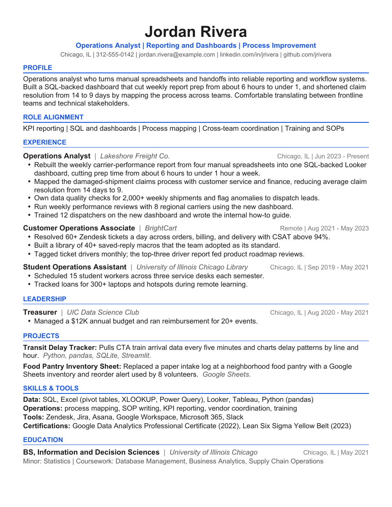

# resume-engine

An evidence-gated, one-page resume builder driven by a coding agent (Claude Code or Codex).

You keep one master `PROFILE.md` with everything true about your career. For each job, the agent writes a small JSON spec that picks and reframes facts for that role, and every line in it has to cite a fact ID. The engine refuses to build if anything cites a fact that doesn't exist, then renders a DOCX and PDF and tunes the spacing until the page is 95-97% full. It won't shrink body text below 10 pt: if the content doesn't fit, it tells you to cut something.

What you get per job:

```
output/2026-10-01-acme-operations-analyst/
  Your Name - OA Resume.docx
  Your Name - OA Resume.pdf
  resume-validation.json
```

The bundled example (a fictional profile, in `example/`) renders like this:



## Setup (once)

System tools (used to render and measure the PDF):

```bash
brew install --cask libreoffice
brew install poppler
```

On Linux, install `libreoffice` and `poppler-utils` with your package manager. If either one lives somewhere unusual, set `SOFFICE=/path/to/soffice` or `PDFTOTEXT=/path/to/pdftotext`.

Python 3.10+:

```bash
python3 -m venv .venv
.venv/bin/pip install -r requirements.txt
```

Check it works by building the example:

```bash
.venv/bin/python resume.py --data example build base
```

## Start with your own profile

Open this folder in Claude Code (or Codex) and say:

> Set me up. Here's my profile: /path/to/my-profile.md

or

> Set me up from my resume: /path/to/resume.pdf

That runs the `resume-setup` skill. It writes your `data/PROFILE.md`, registers your facts in `data/resume_facts.json`, writes a base spec, builds it, and lists anything it couldn't tell from your source so you can confirm it. It won't make up facts.

`data/` and `output/` are gitignored, so your personal info stays on your machine unless you choose to commit it.

## Tailor to a job

Paste a job description into Claude Code and say "tailor my resume to this" (or `/tailor-resume`). The agent maps the posting's keywords to your facts, lists the ones you have no evidence for (and asks whether any are actually true), writes `data/specs/<company-role>.json`, builds it, and checks the rendered page.

## Running it by hand

```bash
.venv/bin/python resume.py validate <spec>              # evidence check only, no render
.venv/bin/python resume.py build <spec>                 # fit + render + checks
.venv/bin/python resume.py build <spec> --hide-phone    # public copy without phone
.venv/bin/python resume.py --data some/other/dir build base
```

`<spec>` can be a path or just a name in `data/specs/`. Set `RESUME_DATA=/path` to keep your data folder somewhere else (a private notes vault, for example).

## How the data fits together

| File | What it is |
|---|---|
| `data/PROFILE.md` | The only source of truth. Human-readable, any structure, but it needs a `## Contact` block (below). |
| `data/resume_facts.json` | A registry of fact IDs, each with a `source` (`PROFILE.md#Section`) and a short `note`. Specs can only cite these IDs. |
| `data/specs/*.json` | One per target role: headline, summary, which roles and bullets to show, skills, education. Every item cites fact IDs. |

`PROFILE.md` contact block (Name and Email required, the rest optional):

```markdown
## Contact

- Name: Jordan Rivera
- Location: Chicago, IL
- Phone: 312-555-0142
- Email: jordan.rivera@example.com
- LinkedIn: https://www.linkedin.com/in/jrivera/
- GitHub: https://github.com/jrivera
- Website: https://jrivera.dev
```

Optional look-and-feel, in `resume_facts.json` (or per spec):

```json
"style": { "font": "Arial", "accent": "1A56DB" }
```

## Rules the engine enforces

- Every summary, role, bullet, project, skill line, and education entry cites at least one known fact ID.
- No em or en dashes (use plain hyphens). They're a common tell of generated text and some ATS parsers mangle them.
- Exactly one Letter page, 95-97% filled, nothing past the 0.5" margins, body text 10 pt or larger.
- Contact, then Experience, then Skills, in that order.

The rules the agent follows on top of that (real job titles only, no invented numbers or outcomes, a content budget that fits one page) are in `.claude/skills/tailor-resume/SKILL.md`.

## Tests

```bash
.venv/bin/python -m unittest -v tests/test_engine.py
RESUME_ARTIFACT_DIR="output/<dir>" .venv/bin/python -m unittest -v tests/test_engine.py
```

## Files

| File | Role |
|---|---|
| `resume.py` | CLI: `init`, `validate`, `build` (the fit loop) |
| `resume_factory.py` | Evidence validation and DOCX layout |
| `resume_checks.py` | PDF geometry, page count, fill, overflow, section order |
| `example/` | Fictional profile, facts, and spec |
| `docs/example-resume.png` | Render of the example |
| `.claude/skills/` | `resume-setup` and `tailor-resume` agent workflows |
| `AGENTS.md` | Instructions for any coding agent working in this repo |

## License

MIT
